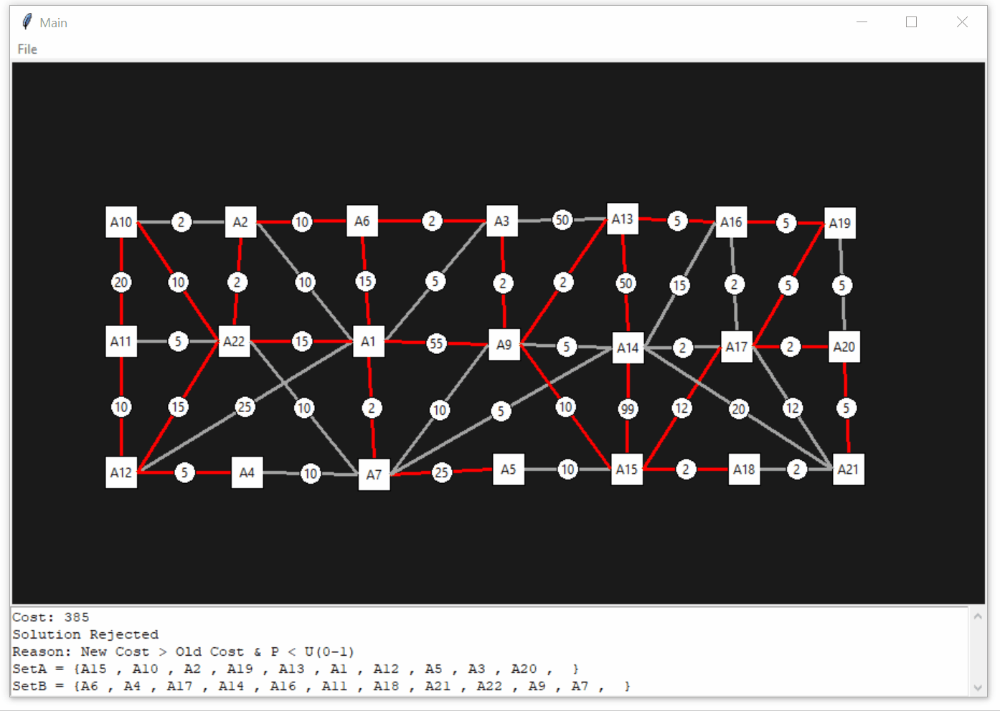

# Heuristic Solver

Heuristic Solver is a GUI for creating and solving NP-type problems using heuristic algorithms such as simulated annealing.





## Dependencies/Usage
Heuristic Solver is fully made in standard python and no extra dependencies are required.

It is developed and tested in Python3. To start the GUI in python3 use the following command directly:

```sh
$ python ./start_ui.py
```
However, it should still execute in Python2 by first changing the import statements in `user_interface.py` from `tkinter` to `Tkinter`. Then running the above command.

To use the Examples follow these steps:
1. On the main UI interface click on `File->Import Netlist`. This will open a filedialog. 
2. Navigate to the Examples directory and select on a example file. This will import the netlist into the main UI
3. The promblem can then be solved by clicking on `Solve->*select solver of choice*` on the main UI


